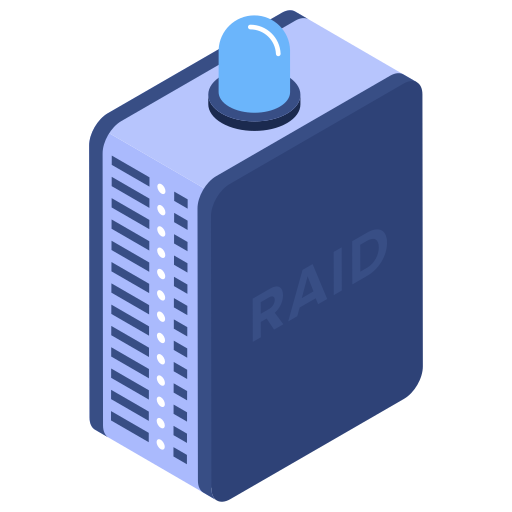
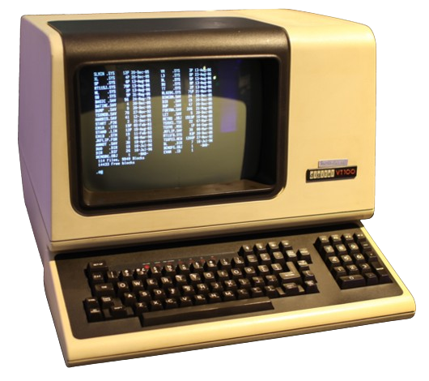
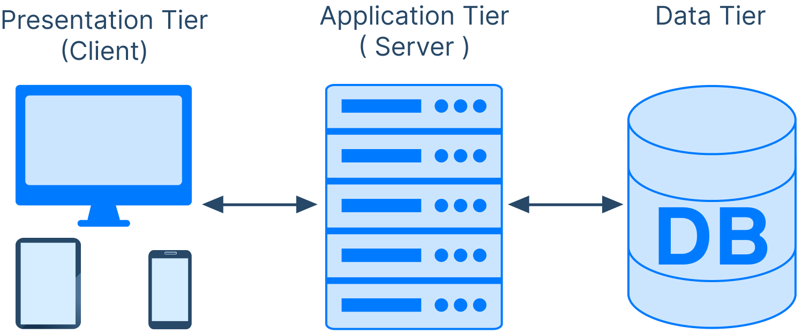

# Table of Contents

<!--toc:start-->
- [Table of Contents](#table-of-contents)
- [1. Introduction](#1-introduction)
  - [1.1. Client Server Model](#11-client-server-model)
  - [1.2 Advantage of Client-Server architecture](#12-advantage-of-client-server-architecture)
    - [1.2.1 Centralized resources](#121-centralized-resources)
    - [1.2.2 Better security](#122-better-security)
    - [1.2.3 Server-level administration](#123-server-level-administration)
    - [1.2.4 Scalable network](#124-scalable-network)
  - [1.3. Disadvantages of the client/server model](#13-disadvantages-of-the-clientserver-model)
    - [1.3.1 High cost](#131-high-cost)
    - [1.3.2 A weak link](#132-a-weak-link)
  - [1.4 How a client/server system works](#14-how-a-clientserver-system-works)
    - [Client initiates request](#client-initiates-request)
    - [Server processes request](#server-processes-request)
    - [Server sends response](#server-sends-response)
    - [Client displays response](#client-displays-response)
  - [1.5 The generations of C/S](#15-the-generations-of-cs)
    - [1.5.1 The first generation](#151-the-first-generation)
    - [1.5.2 The second generation](#152-the-second-generation)
    - [1.5.3 Overview of two-tier architecture](#153-overview-of-two-tier-architecture)
    - [1.5.4 Overview of three-tier architecture](#154-overview-of-three-tier-architecture)
    - [1.5.5 Comparison of the two types of architecture](#155-comparison-of-the-two-types-of-architecture)
    - [1.5.6 Multi-Level Architecture](#156-multi-level-architecture)
<!--toc:end-->

# 1. Introduction

{width=400px}

## 1.1. Client Server Model

The client–server model is a **distributed** application structure that partitions tasks or workloads between the providers of a resource or service, called **servers**, and service **requesters**, called clients.

Often clients and servers communicate over a computer network on separate hardware, but both client and server may reside in the same system. A **server host** runs one or more server programs, which share their resources with clients.

A client usually does not share any of its resources, but it requests content or service from a server. Clients, therefore, initiate communication sessions with servers, which await incoming requests. Examples of computer applications that use the client–server model are **email**, network printing, and the **World Wide Web**.

## 1.2 Advantage of Client-Server architecture

:::columns

:::{.column width=50%}

Client-Server architecture has several  
advantages, such as:

::::

:::{.column width=35%}
{width=150px}
::::

:::

### 1.2.1 Centralized resources

:::columns

:::{.column width=50%}

When all of the data is stored in a single place, it is much easier for administrators to manage and maintain a **single** server, rather than having to manage multiple servers or devices.

::::

:::{.column width=35%}
{width=150px}
::::

:::

### 1.2.2 Better security

:::columns

:::{.column width=50%}

Because of the centralized nature of client/server architecture, it is easier to implement security measures such as access control and data encryption.

It is also easier to monitor the system for suspicious activity and to quickly respond to security incidents.

::::

:::{.column width=35%}
{width=150px}
::::

:::

### 1.2.3 Server-level administration

:::columns

:::{.column width=50%}

All of the administration tasks are performed on the server.

This makes it easier to manage the system as a whole, and it also makes it easier to troubleshoot problems.

::::

:::{.column width=35%}
{width=150px}
::::

:::

### 1.2.4 Scalable network

:::columns

:::{.column width=50%}

Client/server architecture can be expanded to accommodate more users and data. This is because the server can be upgraded to handle more requests, and new clients can be added to the network without impacting the performance of the system as a whole.

::::

:::{.column width=35%}
{width=150px}
::::

:::

## 1.3. Disadvantages of the client/server model

:::columns

:::{.column width=50%}

Client-Server architecture has several  
disadvantages, such as:

::::

:::{.column width=35%}
{width=150px}
::::

:::

### 1.3.1 High cost

:::columns

:::{.column width=50%}

Setting up and maintaining a server can be expensive. The cost of hardware, software, and IT staff can be significant, especially for large organizations.

::::

:::{.column width=35%}
{width=150px}
::::

:::

### 1.3.2 A weak link

:::columns

:::{.column width=50%}

If the server goes down, the entire network is affected. This can be a major problem for businesses that rely on their networks to operate.

::::

:::{.column width=35%}
{width=150px}
::::

:::

## 1.4 How a client/server system works

---

### Client initiates request

1. The client sends a request to the server over a network.  
   The request typically includes information about the resource or service that is needed, such as the URL of a web page or the name of a file.

### Server processes request

2. The server receives the request and processes it.  
   This may involve retrieving data from a database, performing calculations, or running an application.

### Server sends response

3. The server sends a response back to the client.  
   The response typically includes the requested resource or service, such as the HTML code for a web page or the contents of a file.

### Client displays response

4. The client receives the response and displays it to the user.  
   This may involve rendering an HTML page, opening a file, or displaying a message

## 1.5 The generations of C/S

The client-server model has evolved over time, and different generations of client-server systems have been developed.

### 1.5.1 The first generation

::::columns

:::{.column width=50%}

{width=75px}

The first generation of client-server architecture was based on mainframes and connected to dumb terminals. The processing was done on the mainframes, and the PCs were able to communicate with each other on a network. These networks were based on file sharing architecture, where the PC downloads files from the corresponding file server and the application is running locally using the data received.

:::

:::{.column width=25%}

{width=150px}

:::

::::

### 1.5.2 The second generation

:::columns

:::{.column width=50%}

The second generation of client-server architecture evolved with the improvement in computer technology. The processing demands started to split between personal computers and mainframes. As the networks grew, the limitations of file sharing architectures became the obstacles in the client-server system. This problem was solved by replacing the file server with a database server. Instead of transmitting and saving the file to the client, the database server executes requests for data and returns the result sets to the client. This architecture decreased the network traffic, allowing multiple users to update data at the same time.

::::

:::{.column width=25%}
{width=150px}
::::

:::

### 1.5.3 Overview of two-tier architecture

:::columns

:::{.column width=50%}

This is an fundamental software architecture which consists of two layers or tier one is client and another is server each tier has there own responsibility and they are interlinked with each other or dependent on each other

::::

:::{.column width=45%}
{width=200px}
::::

:::

---

- **Client tier**  
  Is the top most layer which is like an user interface and interaction part of the application. it acts as an web browser, desktop application, or mobile app, through which the user interacts with the application. It is responsible for presenting the data and processing the input of the application.

- **Server tier**  
  is an bottom layer which contains the logic that us required to handle the data processing and data management.

### 1.5.4 Overview of three-tier architecture

:::columns

:::{.column width=50%}

Three-tier architecture is a more advanced system that introduces an additional layer, the application or business logic tier, between the client and the server.

::::

:::{.column width=45%}
{width=200px}
::::

:::

In a three-tier system, the application logic or process lives in the middle-tier, separated from the data and the user interface. This architecture is more scalable, robust, and flexible than the two-tier architecture. It can integrate data from multiple sources, making it suitable for larger applications.

---

- **Presentation Tier**  
  It is the user interface and topmost tier in the architecture. Its purpose is to take request from the client and displays information to the client.

- **Application Tier**  
  It is the middle tier of the architecture also known as the logic tier or business tier as the information/request gathered through the presentation tier is processed in detail here.

- **Data Tier**  
  It is the last tier of the architecture also known as the Database Tier. It is used to store the processed information so that it can be retrieved later on when required.

### 1.5.5 Comparison of the two types of architecture

|     | Two-Tier architecture                                                                                                         | Three-Tier Architecture                                                                                           |
| --- | ----------------------------------------------------------------------------------------------------------------------------- | ----------------------------------------------------------------------------------------------------------------- |
| 1.  | Consists of two layers : Client Tier and Database (Data Tier)                                                                 | Consists of three layers: Presentation Layer (Client), Application Layer (Server), and Database Layer             |
| 2.  | Easy to build and maintain                                                                                                    | Complex to build and maintain                                                                                     |
| 3.  | Typically slower                                                                                                              | Improved performance                                                                                              |
| 4.  | The application logic is either buried inside the user interface on the client or within the database on the server (or both) | The application logic or process resides in the middle-tier, it is separated from the data and the user interface |
| 5.  | Less secured as client can communicate with database directly                                                                 | Secured with middle tier                                                                                          |
| 6.  | e.g. Traditional desktop apps                                                                                                 | e.g. Web-based applications                                                                                       |

### 1.5.6 Multi-Level Architecture

Multitier architecture (often referred to as n-tier architecture) is a client–server architecture in which presentation, application processing and data management functions are physically separated. The most widespread use of multitier architecture is the three-tier architecture.
