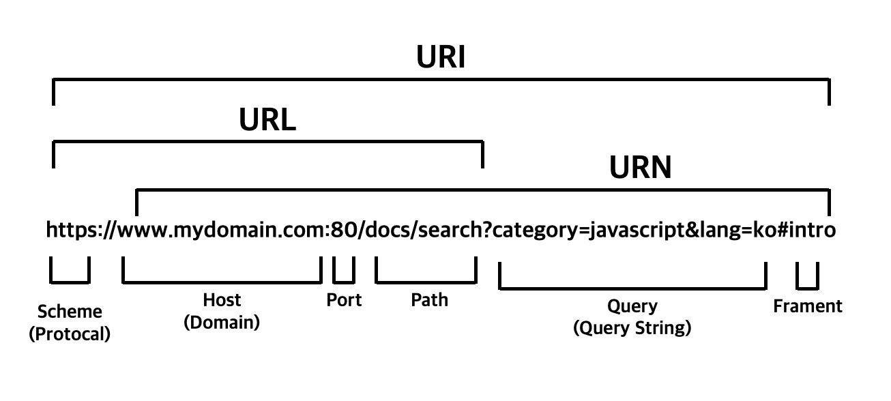
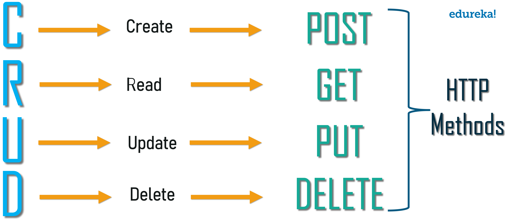

# Table of Contents

<!--toc:start-->
- [Table of Contents](#table-of-contents)
- [2. Client/server architecture](#2-clientserver-architecture)
  - [2.1 Client/server dialogue techniques](#21-clientserver-dialogue-techniques)
    - [2.1.1 Request-response](#211-request-response)
<!--toc:end-->

# 2. Client/server architecture

## 2.1 Client/server dialogue techniques

Client-server dialogue techniques are methods used to manage the flow of communication between a client and a server in a distributed system. These techniques ensure that the client and server can exchange information efficiently and reliably.

### 2.1.1 Request-response

This is the **simplest** and **most common** technique. The client sends a request to the server, and the server sends a response back to the client. This technique is used for many different types of requests, such as retrieving data, submitting data, and invoking operations. This pattern is typically implemented in a purely synchronous fashion, as in web service calls over HTTP, which holds a connection open and waits until the response is delivered or the timeout period expires.

The most common protocol request/response pattern used on a network is the HTTP (Hypertext Transfer Protocol), which is a protocol that operates over the TCP (Transmission Control Protocol). By default, it uses port 80 for unencrypted connections and port 443 for encrypted connections (using HTTPS).

---

**Key components:**

1. **Uniform Resource Identifier (URI):**

   The client includes a **URI** in the request to specify the desired resource.

   The **URI** (Uniform Resource Identifiers) can be one of two things, a **URL** (Uniform Resource Locator) or a **URN** (Uniform Resource Name).

   {width=300px}

---

2. **HTTP Methods:**

   HTTP defines several methods that specify the desired action to be performed on the server.

   The most commonly used methods are:

   - **GET:** Retrieves a representation of a resource.
   - **POST:** Submits data to be processed by the server, often used for form submissions.
   - **PUT:** Updates or replaces a resource with the provided data.
   - **DELETE:** Removes a specified resource.

   {width=300px}

---

3. Headers:

   The client can include additional headers in the request to provide information to the server. Headers can specify things like the client’s user agent, accepted content types, authentication credentials, and more.

   **Example:** `User-Agent: Mozilla/5.0` , `Accept: text/html`

   The server includes headers in the response to provide information back to the client. Headers can specify things like the content type of the response, caching directives, cookies, and more.

   **Example:** `Content-Type: application/json` , `Cache-Control: max-age=3600`

---

4. **Body:**

   For methods like **POST** and **PUT,** the client can include a request body that contains additional data to be sent to the server. The format of the request body depends on the data being transmitted (e.g., form data, JSON payload). The response body contains the actual data returned by the server, format depends on the requested resource.
