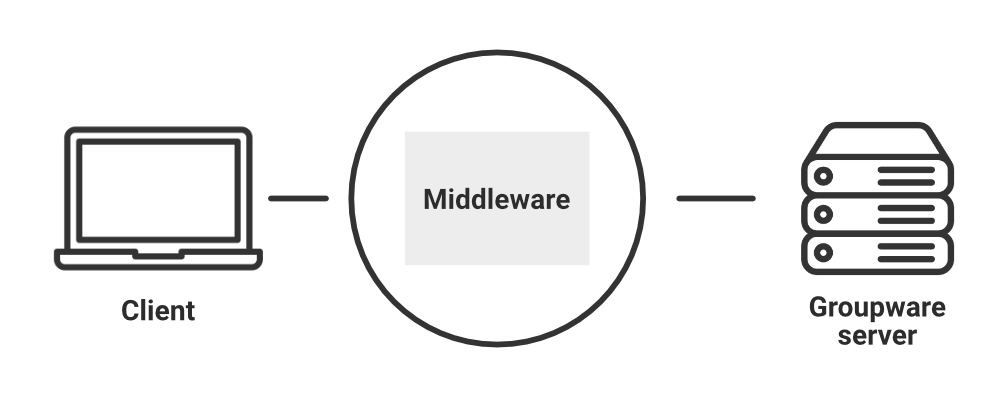
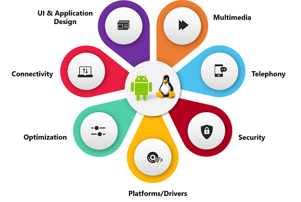

# Middleware

## Definition

{width=300px}

It is software that helps to **connect** the operating system and applications. Or it is software that runs **between client** and **server** processes. Generally, this software is written in such a way that the user never notices the presence of middleware. It also helps in delivering **secure** and **transparent** services to users.

## Types of Middleware

1. **RPC – Remote Procedure Calls** (RPC)
   - client makes calls to procedures running on remote computers
   - synchronous and asynchronous

2. **Message-Oriented Middleware** (MOM)
   - asynchronous calls between the client via message queues

3. **Publish/Subscribe**
   - push technology server sends information to client when available

4. **Object Request Broker** (ORB)
   - Object-oriented management of communications between clients and servers

5. **SQL-oriented Data Access**
   - Middleware between applications and database servers

## Features

The middleware layer has evolved to the most appropriate place for functionality, such as:

1. **Connection Management:** Opens and closes connections between applications.
2. **Request Handling:** Receives requests, sends them to the right place, and delivers results back to the sender.
3. **Process Startup:** Initializes applications on different computers.
4. **Service Directory:** Keeps track of where all the applications and services are located.
5. **Remote Data Access:** Allows applications to access data on other computers.
6. **Security & Trust:** Checks IDs, encrypts data, and ensures things are reliable.
7. **Monitoring & Alerting:** Watches over computers and devices, reporting any problems.
8. **Process Shutdown:** Stops applications when they're done.
9. **Caching:** Stores frequently used data for faster access.
10. **Easy-to-Use Interface:** Provides a simple way for applications to talk to each other.
11. **Hides Complexity:** Makes different hardware and software work together seamlessly.
12. **Anywhere Applications:** Lets applications run on any computer.
13. **Different Apps Talking:** Enables applications built with different tools to work together.
14. **Shared Services:** Provides common tools.

## Example

:::columns

:::{.column width=60%}

The **Android** operating system uses the **Linux** kernel at its core, and also provides an application framework that developers incorporate into their applications. In addition, **Android** provides a middleware layer including libraries that provide services such as **data storage**, **screen display**, **multimedia**, and **web browsing**. Because the middleware libraries are compiled to machine language, services execute quickly. Middleware libraries also implement device-specific functions, so applications and the application framework need not concern themselves with variations between various Android devices. Android's middleware layer also contains the ART virtual machine and its core Java application libraries.

:::

:::{.column width=30%}

{width=200px}

:::

::::
