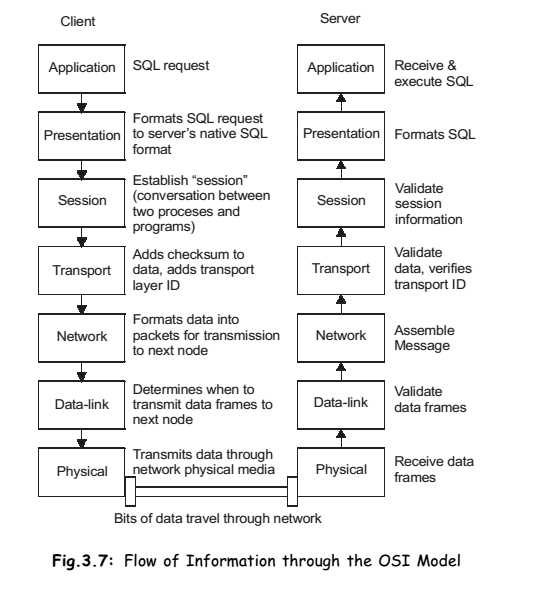
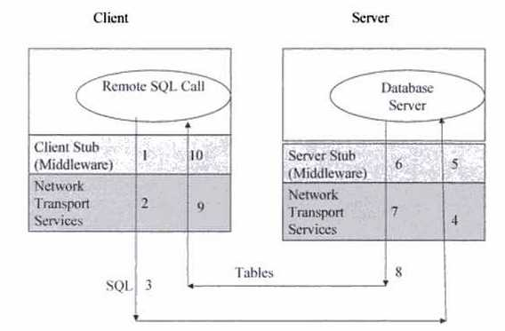

# Table of Contents

<!--toc:start-->
- [Table of Contents](#table-of-contents)
- [3. Middleware](#3-middleware)
  - [3.1 Definition](#31-definition)
    - [Types of Middleware](#types-of-middleware)
  - [3.2 Features](#32-features)
    - [Example](#example)
  - [3.4 Login procedure](#34-login-procedure)
  - [3.4.1 Preparing requests](#341-preparing-requests)
  - [3.4.2 Executing queries](#342-executing-queries)
  - [3.4.3 Retrieving results](#343-retrieving-results)
  - [3.4.3.1 JDBC Examples](#3431-jdbc-examples)
    - [Create Database Example](#create-database-example)
    - [Insert Records Example](#insert-records-example)
    - [Drop Database Example](#drop-database-example)
  - [3.4.4 Results cache management](#344-results-cache-management)
  - [3.4.5. Query cache management](#345-query-cache-management)
  - [3.4.6. Disconnect procedure](#346-disconnect-procedure)
<!--toc:end-->

# 3. Middleware

## 3.1 Definition

{width=300px}

It is software that helps to **connect** the operating system and applications. Or it is software that runs **between client** and **server** processes. Generally, this software is written in such a way that the user never notices the presence of middleware. It also helps in delivering **secure** and **transparent** services to users.

### Types of Middleware

1. **RPC – Remote Procedure Calls** (RPC)

   - client makes calls to procedures running on remote computers
   - synchronous and asynchronous

2. **Message-Oriented Middleware** (MOM)

   - asynchronous calls between the client via message queues

3. **Publish/Subscribe**

   - push technology server sends information to client when available

4. **Object Request Broker** (ORB)

   - Object-oriented management of communications between clients and servers

5. **SQL-oriented Data Access**
   - Middleware between applications and database servers

## 3.2 Features

The middleware layer has evolved to the most appropriate place for functionality, such as:

1. **Connection Management:** Opens and closes connections between applications.
2. **Request Handling:** Receives requests, sends them to the right place, and delivers results back to the sender.
3. **Process Startup:** Initializes applications on different computers.
4. **Service Directory:** Keeps track of where all the applications and services are located.
5. **Remote Data Access:** Allows applications to access data on other computers.
6. **Security & Trust:** Checks IDs, encrypts data, and ensures things are reliable.
7. **Monitoring & Alerting:** Watches over computers and devices, reporting any problems.
8. **Process Shutdown:** Stops applications when they're done.
9. **Caching:** Stores frequently used data for faster access.
10. **Easy-to-Use Interface:** Provides a simple way for applications to talk to each other.
11. **Hides Complexity:** Makes different hardware and software work together seamlessly.
12. **Anywhere Applications:** Lets applications run on any computer.
13. **Different Apps Talking:** Enables applications built with different tools to work together.
14. **Shared Services:** Provides common tools.

### Example

:::columns

:::{.column width=60%}

The **Android** operating system uses the **Linux** kernel at its core, and also provides an application framework that developers incorporate into their applications. In addition, **Android** provides a middleware layer including libraries that provide services such as **data storage**, **screen display**, **multimedia**, and **web browsing**. Because the middleware libraries are compiled to machine language, services execute quickly. Middleware libraries also implement device-specific functions, so applications and the application framework need not concern themselves with variations between various Android devices. Android's middleware layer also contains the ART virtual machine and its core Java application libraries.

:::

:::{.column width=30%}

{width=200px}

:::

::::

---



## 3.4 Login procedure

Operation to open a pathway from a client to a server designated by a name with username and a password authentication.

The connection allows to find the server and if necessary to initiate a communication session with it. The user is authenticated (its name and password are checked). A process taking into account of its requests (which should normally follow) is activated on the server, if it is not already active.

In a context database server, after, or during the connection, it is necessary to identify the particular DB upon which the user will work.

Generally, the database name connected using the user name, if so, no specific opening procedure is necessary. After login, user can directly prepare or execute queries.

## 3.4.1 Preparing requests

Operation to send a query with parameters not instantiated to a server in order to prepare his execution.

## 3.4.2 Executing queries

Operation to send a request for previously prepared query to server for execution by providing the values of parameters in most of the client server systems, it is efficient to distinguish preparation and execution of queries. Indeed, the preparation often triggers a query compilation, which generates a parametrized execution plan on the server.

During the request execution, parameters are instantiated and the plan is executed without recompilation. For a single preparation, it is possible to request multiple executions, which saves time compilation every time.

However, in the context of ad hoc queries that are executed only once it may be more effective to ask both the preparation and the execution of the query.

A query typically generates a result. There are immediate responses made by the parameters of possible output of the query, including, in particular, an error code, and the results (or delayed answers), which are usually data generated by the query on the server to the client and need to be retrieved by specific commands.

## 3.4.3 Retrieving results

Operation to take back any part of the result of a query on the client. In a database context, the results can be large. For example, a search result in a table, several lines can be found.

In the case of management of binary large objects (BLOB), the results can be composed of several gigabytes. You must retrieve them by portion, by dividing them into physical blocks exchanged effectively between the client and the server. Where the need to put in place sophisticated technique of caches management.

## 3.4.3.1 JDBC Examples

This is an example of how to create a simple JDBC application. This will show you how to open a database connection, execute a SQL query, and display the results.

```java
import java.sql.*;

public class Example {
   static final String DB_URL = "jdbc:mysql://localhost/";
   static final String USER = "guest";
   static final String PASS = "guest123";
   static final String QUERY = "SELECT id, first, last, age FROM Employees";

```

---

```java
   public static void main(String[] args) {
      // Open a connection
      try(Connection conn = DriverManager.getConnection(DB_URL, USER, PASS);
         Statement stmt = conn.createStatement();
         ResultSet rs = stmt.executeQuery(QUERY);) {
         // Extract data from result set
         while (rs.next()) {
            // Retrieve by column name
            System.out.print("ID: " + rs.getInt("id"));
            System.out.print(", Age: " + rs.getInt("age"));
            System.out.print(", First: " + rs.getString("first"));
            System.out.println(", Last: " + rs.getString("last"));
         }
      } catch (SQLException e) {
         e.printStackTrace();
      }
   }
}
```

### Create Database Example

```java
import java.sql.Connection;
import java.sql.DriverManager;
import java.sql.SQLException;
import java.sql.Statement;

public class JDBCExample {
   static final String DB_URL = "jdbc:mysql://localhost/";
   static final String USER = "guest";
   static final String PASS = "guest123";
```

---

```java

   public static void main(String[] args) {
      // Open a connection
      try(Connection conn = DriverManager.getConnection(DB_URL, USER, PASS);
         Statement stmt = conn.createStatement();
      ) {
         String sql = "CREATE DATABASE STUDENTS";
         stmt.executeUpdate(sql);
         System.out.println("Database created successfully...");
      } catch (SQLException e) {
         e.printStackTrace();
      }
   }
}
```

### Insert Records Example

```java
import java.sql.Connection;
import java.sql.DriverManager;
import java.sql.SQLException;
import java.sql.Statement;

public class JDBCExample {
   static final String DB_URL = "jdbc:mysql://localhost/";
   static final String USER = "guest";
   static final String PASS = "guest123";
```

---

```java
   public static void main(String[] args) {
      // Open a connection
      try(Connection conn = DriverManager.getConnection(DB_URL, USER, PASS);
         Statement stmt = conn.createStatement();
      ) {
         // Execute a query
         System.out.println("Inserting records into the table...");
         String sql = "INSERT INTO Registration VALUES (100, 'Zara', 'Ali', 18)";
         stmt.executeUpdate(sql);
         sql = "INSERT INTO Registration VALUES (101, 'Mahnaz', 'Fatma', 25)";
         stmt.executeUpdate(sql);
         sql = "INSERT INTO Registration VALUES (102, 'Zaid', 'Khan', 30)";
         stmt.executeUpdate(sql);
         sql = "INSERT INTO Registration VALUES(103, 'Sumit', 'Mittal', 28)";
         stmt.executeUpdate(sql);
         System.out.println("Inserted records into the table...");
      } catch (SQLException e) {
         e.printStackTrace();
      }
   }
}
```

### Drop Database Example

```java
import java.sql.Connection;
import java.sql.DriverManager;
import java.sql.SQLException;
import java.sql.Statement;

public class JDBCExample {
   static final String DB_URL = "jdbc:mysql://localhost/";
   static final String USER = "guest";
   static final String PASS = "guest123";
```

---

```java

   public static void main(String[] args) {
      // Open a connection
      try(Connection conn = DriverManager.getConnection(DB_URL, USER, PASS);
         Statement stmt = conn.createStatement();
      ) {
         String sql = "DROP DATABASE STUDENTS";
         stmt.executeUpdate(sql);
         System.out.println("Database dropped successfully...");
      } catch (SQLException e) {
         e.printStackTrace();
      }
   }
}
```

---

{width=300px}

---

1. The client issues an SQL call in an API made available by the client middleware. The client API calls can be issued from end user tools or application programs. The client middleware mainly encodes the SQL call into appropriate network messages. As we will see later, the client middleware may support "database procedure" calls in addition to remote SQL calls. The middleware also determines the actual network address of the server and “binds" to it.

2. The network message. containing the SQL statement is prepared and sent to the remote site through network transport services.

3. The message is sent over the communication media and is received by the network transport services of the server machine. If the network architecture of the client machine is different from the network architecture of the server machine, then a network gateway may be needed (e.g., TCP/IP to SNA gateway).

4. The server network system contacts the server middleware that a request has arrived for it.

5. The server middleware gets the network message and schedules the execution of this call by the database server. The middleware may invoke a database procedure consisting of several SQL calls, instead of one SQL call.

---

6. The database server processes the SQL call and develops a response (selected table rows and columns) which is sent to the server middleware.

7. The server middleware translates the response into one or more network messages which are sent to the network system. The middleware may cache many messages before an appropriate response to the client can be developed. For example. The server middleware may not send the entire selected table back to client as a single response; instead, it may send large tables as several blocks (e.g., 4 megabytes) of data.

8. The server network system sends the response back to the client network system. Once again, a gateway may be needed if the client and server network architectures are dissimilar.

9. The client network system sends the response messages to the client middleware.

10. The client middleware receives the response message, translates this message into call responses, and sends the response back to the client. The middleware may supply the response to the client one row at a time based on "FETCH" statements issued by the client process.

## 3.4.4 Results cache management

Techniques to transfer the results by blocks and keep them on the client or / and on the server in order to use them to respond to queries. Beyond the results, middleware can also store queries with execution plans prepared on the server in order to avoid preparing them again during a new request.

## 3.4.5. Query cache management

Techniques to keep queries compiled on the server in order to use them to respond to similar requests. Queries and execution plans related can be simply stored in memory: they are then lost at the end of the working session.

In a more sophisticated way, plans can be stored in the database or in a file and recovered when connecting. This allows important optimization. Whatever the case a working session always ends with a disconnection that allows you to release resources occupied on the server.

## 3.4.6. Disconnect procedure

Reverse operation of the connection to close the pathway opened from the client to the server.
