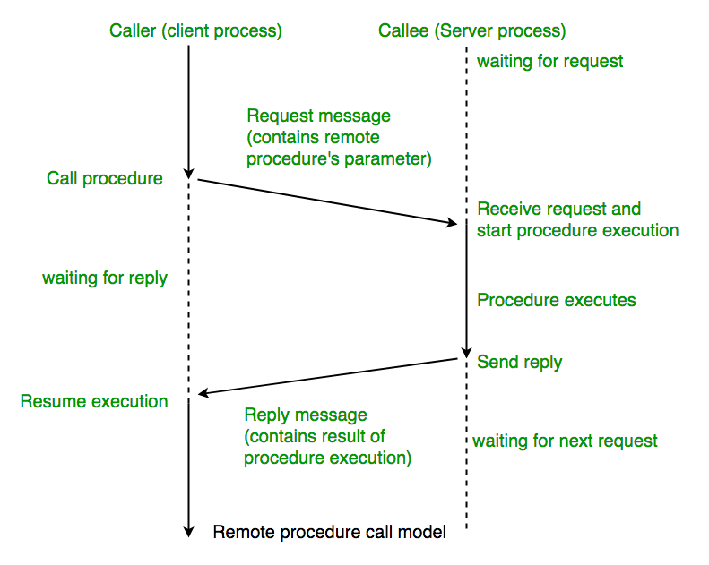
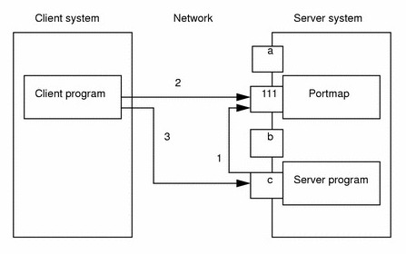
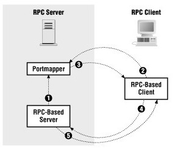
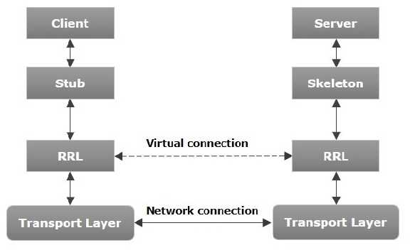
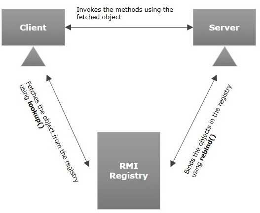
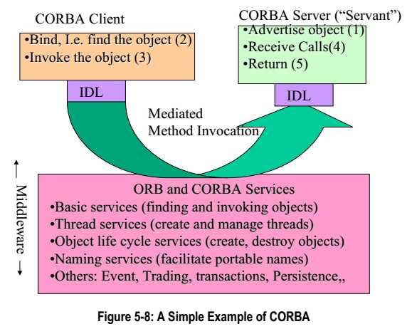
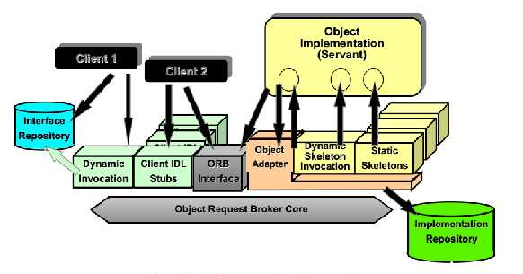

# Table of Contents

<!--toc:start-->
- [Table of Contents](#table-of-contents)
- [4. Remote Procedure Call (RPC)](#4-remote-procedure-call-rpc)
  - [4.1 Introduction](#41-introduction)
  - [4.2. RPC model](#42-rpc-model)
    - [Sequence of events](#sequence-of-events)
    - [4.3. Identifying remote procedures](#43-identifying-remote-procedures)
    - [4.4. Dynamic allocation of transport ports to RPC programs](#44-dynamic-allocation-of-transport-ports-to-rpc-programs)
  - [4.5. Semantics of transport for RPC](#45-semantics-of-transport-for-rpc)
  - [4.6. RPC Authentication](#46-rpc-authentication)
  - [4.7. RPC Message Format](#47-rpc-message-format)
    - [Example:](#example)
  - [4.8. RPC Language](#48-rpc-language)
  - [4.9 Practical application](#49-practical-application)
    - [4.9.1. Sun Java RMI](#491-sun-java-rmi)
    - [4.9.2. RMI Security](#492-rmi-security)
    - [4.9.3. RMI-IIOP](#493-rmi-iiop)
    - [4.9.4. OMG CORBA](#494-omg-corba)
<!--toc:end-->

# 4. Remote Procedure Call (RPC)

## 4.1 Introduction

{width=300px}

---

A remote procedure call (RPC) is when a computer program causes a procedure (subroutine) to execute in a different address space (commonly on another computer on a shared network), which is written as if it were a normal (local) procedure call, without the programmer explicitly writing the details for the remote interaction. That is, the programmer writes essentially the same code whether the subroutine is local to the executing program, or remote. This is a form of client–server interaction (caller is client, executor is server), typically implemented via a request–response message-passing system.

## 4.2. RPC model

RPC is a request–response protocol. An RPC is initiated by the client, which sends a request message to a known remote server to execute a specified procedure with supplied parameters. The remote server sends a response to the client, and the application continues its process. While the server is processing the call, the client is blocked (it waits until the server has finished processing before resuming execution), unless the client sends an asynchronous request to the server, such as an XMLHttpRequest. There are many variations and subtleties in various implementations, resulting in a variety of different (incompatible) RPC protocols.

An important difference between remote procedure calls and local calls is that remote calls can fail because of unpredictable network problems. Also, callers generally must deal with such failures without knowing whether the remote procedure was actually invoked. Idempotent procedures (those that have no additional effects if called more than once) are easily handled, but enough difficulties remain that code to call remote procedures is often confined to carefully written low-level subsystems.

### Sequence of events

1. The client calls the client stub. The call is a local procedure call, with parameters pushed on to the stack in the normal way.
2. The client stub packs the parameters into a message and makes a system call to send the message. Packing the parameters is called marshalling.
3. The client's local operating system sends the message from the client machine to the server machine.
4. The local operating system on the server machine passes the incoming packets to the server stub.
5. The server stub unpacks the parameters from the message. Unpacking the parameters is called unmarshalling.
6. Finally, the server stub calls the server procedure. The reply traces the same steps in the reverse direction.

### 4.3. Identifying remote procedures

Each RPC procedure is uniquely identified by a program number, version number, and procedure number.

The program number identifies a group of related remote procedures, each of which has a different procedure number. Program numbers are given out in groups of hexadecimal 20000000.

0 - 1fffffff defined by Sun  
20000000 - 3fffffff defined by user  
40000000 - 5fffffff transient  
60000000 - 7fffffff reserved  
80000000 - 9fffffff reserved  
a0000000 - bfffffff reserved  
c0000000 - dfffffff reserved  
e0000000 - ffffffff reserved

---

Each program also has a version number, so when a minor change is made to a remote service (adding a new procedure, for example), a new program number does not have to be assigned.

The first implementation of a program will most likely have version number 1. Because most new protocols evolve into better, stable, and mature protocols, a version field of the call message identifies the version of the protocol the caller is using. Version numbers make speaking old and new protocols through the same server process possible.

Version numbers are incremented when functionality is changed in the remote program. Existing procedures can be changed or new ones can be added. More than one version of a remote program can be defined and a version can have more than one procedure defined. The procedure number identifies the procedure to be called. These numbers are documented in the specific program's protocol specification.

### 4.4. Dynamic allocation of transport ports to RPC programs

**Mapping A Remote Program To A Protocol Port**

In RPC programs, dynamic allocation of transport ports refers to the process where servers don't have predefined port numbers.
Instead, they request available ports from the operating system during startup. This approach offers several advantages compared to static port allocation

**Benefits:**

:::columns

::::{.column width=65%}

- **Flexibility:** RPC servers don't need to be tied to specific, predefined port numbers. This avoids conflicts if multiple RPC servers run on the same machine.
- **Security:** Not using well-known ports can slightly obscure the services running on a machine, providing a minor layer of security through obscurity.
- **Firewall Compatibility:** In some network setups, firewalls might be configured to only allow traffic for specific ports. Dynamic allocation helps you get around potential restrictions.

::::

::::{.column width=35%}

{width=80%}

::::

:::

---

**Why Standard/Static Ports Aren't Used?**

One of the challenges in **RPC** is that the number of potential **RPC** programs can far exceed the available port numbers.
Since both **TCP** and **UDP** use 16-bit port numbers, offering only 65,536 possibilities, while program numbers can represent over 4 billion (2^32) programs.
This makes it **impossible** to directly map a program number to a port number. To overcome this limitation, **RPC** utilizes **dynamic port allocation**. Here's how it works:

1. **Server Startup:** When an RPC server starts, it requests an available port from the operating system. This assigned port is temporary and might change with each server restart.
2. **Portmapper/RPCBIND Registration:** The server registers its program number, version number, and the dynamically assigned port with a special service called **portmapper** or **RPCBIND**. This service acts like a phonebook, mapping program information to their assigned ports.
3. **Client Inquiry:** When a client wants to use an RPC service, it:
   - Contacts the portmapper/RPCBIND on a well-known port (usually 111).
   - Provides the desired program number and version information.
4. **Portmapper Lookup:** The portmapper/RPCBIND searches its registry and retrieves the corresponding dynamically assigned port for the requested program.
5. **Client Connection:** The client then establishes a direct connection to the server using the retrieved port number and communicates using the chosen protocol (TCP/UDP).

---

**Example of Dynamic Port Allocation in RPC**

:::columns

::::{.column width=70%}

1. **Server:** An RPC server for a "File Sharing" program starts and dynamically requests a port from the operating system. Let's say it receives port number **45678**.
2. **Server Registration:** The server registers its program information (program name: "File Sharing", version: 1.0) and the assigned port (45678) with the **portmapper/RPCBIND** service (usually on port 111).
3. **Client:** A client program wants to access the "File Sharing" service.
   - _Client cannot directly connect:_ The client doesn't know the server's dynamically assigned port.
   - _Client Inquiry:_ The client contacts the portmapper/RPCBIND on port 111 and asks for information about the "File Sharing" program (version 1.0).

::::

::::{.column width=30%}

{width=150px}

::::

:::

4. **Portmapper Lookup:** The portmapper searches its registry and finds the program information. It retrieves the corresponding dynamically assigned port (45678).
5. **Client Connection:** The client now knows the server's port (45678) and can establish a direct connection to the server using that port to access the "File Sharing" service.

## 4.5. Semantics of transport for RPC

Imagine you're calling a friend on the phone, but sometimes the call gets dropped and you need to call again. due to traffic or network issues, the message might be delivered multiple times.
This can be problematic when working with Remote Procedure Calls (RPCs), where we want to ensure the remote procedure executes as intended.

There are three choices of call semantics, which define how RPC systems handle situations where the request might be sent multiple times:

1. **Exactly once:** This is the ideal scenario, guaranteeing the procedure runs only once even if the request is sent multiple times. It's crucial for sensitive operations like financial transactions to avoid duplicate actions. However, achieving this is the most challenging.
2. **At most once:** A successful response from the remote computer confirms the procedure was executed at most once. However, if there's an error or the response is lost, the system can't guarantee execution. This might be suitable for situations where retries are acceptable.
3. **At least once:** This ensures the procedure runs at least once. The client might resend the request until it receives a successful response. This can lead to multiple executions, which might be undesirable in some cases, but it's often used for idempotent procedures.

## 4.6. RPC Authentication

To ensure **secure** communication, **RPC** defines various authentication methods. These range from a simple scheme using UNIX credentials to a more robust approach using **Data Encryption Standard** (DES).
Here's an overview of the common authentication types:

- **NULL Authentication:** No authentication is performed. Neither the client nor the server verifies each other's identity. This is suitable for low-risk situations like accessing a public time server.
- **UNIX Style Authentication:** This method relies on the client providing its hostname, user ID, local timestamp, and group information. The server uses this information to grant or deny access. However, this method is considered weak as anyone can impersonate a user by knowing their credentials on the client machine. It's primarily used in NFS (Network File System).
- **Data Encryption Standard (DES):** This method offers stronger security. The client sends a password to the server in an encrypted format using a shared secret key. This makes it significantly harder for unauthorized users to eavesdrop and impersonate legitimate users.
- **SHORT:** This method is primarily used for subsequent messages after the initial connection is established. After initial authentication, the client receives a "handle" used for future communication, eliminating the need to repeatedly send credentials. This enhances security as an attacker cannot easily forge the handle.

## 4.7. RPC Message Format

The RPC protocol uses a specific format for messages exchanged between clients and servers. It consists of several key elements:

- **Message ID:** A unique identifier for each message, allowing proper response matching.
- **Message Type:** Indicates whether the message is a **CALL** (requesting a procedure execution) or a **REPLY** (responding to a previous request).
- **RPC Version Number:** Specifies the version of the RPC library being used.
- **Remote Program:** The name of the program on the server that the procedure call is intended for.
- **Remote Program Version:** The specific version of the program being targeted.
- **Remote Procedure:** The name of the specific procedure being invoked on the server.
- **Procedure Arguments (CALL):** The data sent to the server for the procedure execution (only present in CALL messages).
- **Procedure Results (REPLY):** The data returned by the server after executing the procedure (only present in REPLY messages).

### Example:

- **Client sends a CALL message to a server to get the current date:**

  ```
  Message ID: 1234 (unique identifier)
  Message Type: CALL
  RPC Version Number: 2 (version of the RPC library)
  Remote Program: "DateService"
  Remote Program Version: 1
  Remote Procedure: "GetCurrentDate"
  Procedure Arguments: (empty, as no arguments are needed)
  ```

- **Server replies with a REPLY message:**

  ```go
  Message ID: 1234 (matching the original CALL message ID)
  Message Type: REPLY
  RPC Version Number: 2
  Remote Program: "DateService"
  Remote Program Version: 1
  Remote Procedure: "GetCurrentDate"
  Procedure Results: "2024-03-05" (the current date)
  ```

## 4.8. RPC Language

The easiest way to define and generate the protocol is to use a compiler such as **rpcgen**.

rpcgen generates code (stubs) that hides the network communication details from both the client and server code.

These stubs can be compiled and linked with the developer's code to create a functional **RPC** program. The client calls the local stubs as if they were local procedures, and the server procedures are linked with the server stub to handle remote calls.

The **rpcgen** command generates C code to implement a Remote Procedure Call (RPC) protocol. The **input** to the **rpcgen** command is a language similar to C language known as **RPC Language**. The most common use form for the **rpcgen** command where it takes an input file and generates four output files.

For example, if the `InputFile` parameter is named `proto.x`, then the rpcgen command generates the following:

| File         | Description                                                                    |
| ------------ | ------------------------------------------------------------------------------ |
| proto.h      | A header file of definitions common to the server and the client               |
| proto_xdr.c  | A set of XDR routines that translate each data type defined in the header file |
| proto_svc.c  | A stub program for the server                                                  |
| proto_clnt.c | A stub program for the client                                                  |

## 4.9 Practical application

### 4.9.1. Sun Java RMI

**RMI**, short for Remote Method Invocation, is a **mechanism** that allows objects residing in separate Java Virtual Machines (JVMs) to access and invoke methods on each other.
This capability is particularly useful for building distributed applications, as it facilitates remote communication between Java programs. **RMI** functionality is provided within the `java.rmi` package.

**Architecture of an RMI Application**

In an **RMI** application, we write two programs,

- A **server** program (resides on the server).
- A **client** program (resides on the client).

Inside the server program, a remote object is created and reference of that object is made available for the client (using the registry).

The client program requests the remote objects on the server and tries to invoke its methods.

---

The following diagram shows the architecture of an RMI application.

:::columns

::::{.column width=55%}

- **Transport Layer**: This layer connects the client and the server. It manages the existing connection and also sets up new connections.

- **Stub**: A stub is a representation (proxy) of the remote object at client. It resides in the client system; it acts as a gateway for the client program.

- **Skeleton**: This is the object which resides on the server side. stub communicates with this skeleton to pass request to the remote object.

- **RRL (Remote Reference Layer)**: It is the layer which manages the references made by the client to the remote object.

::::

::::{.column width=45%}

{width=200px}

::::

:::

---

**Working of an RMI Application**

When the client makes a call to the remote object, it is received by the stub which eventually passes this request to the **RRL** (Remote Reference Layer).

When the client-side **RRL** receives the request, it invokes a method called invoke() of the object remoteRef. It passes the request to the **RRL** on the server side.

The **RRL** on the server side passes the request to the Skeleton (proxy on the server) which finally invokes the required object on the server.

The result is passed all the way back to the client.

---

**Marshalling and Unmarshalling**

Whenever a client invokes a method that accepts parameters on a remote object, the parameters are **bundled** into a message before being sent over the network.

These parameters may be of **primitive** type or objects. In case of **primitive** type, the parameters are put together and a header is attached to it. In case the parameters are objects, then they are serialized.

This process is known as **marshalling.** At the server side, the packed parameters are unbundled and then the required method is invoked. This process is known as **unmarshalling.**

---

**RMI Registry**

:::columns

::::{.column width=60%}

**RMI registry** is a namespace on which all server objects are placed. Each time the server creates an object, it registers this object with the **RMI registry** (using `bind()` or `reBind()` methods).

These are registered using a **unique** name known as bind name.

To invoke a remote object, the client needs a reference of that object. At that time, the client fetches the object from the registry using its bind name (using `lookup()` method).

The following illustration explains the entire process

::::

::::{.column width=30%}



::::

:::

---

**Goals of RMI**

- To minimize the complexity of the application.
- To preserve type safety.
- Distributed garbage collection.
- Minimize the difference between working with local and remote objects.

---

**Write RMI Java Application**

To write an RMI Java application:

1. Define the remote interface
2. Develop the implementation class (remote object)
3. Develop the server program
4. Develop the client program
5. Compile the application
6. Execute the application

---

1. **Defining the Remote Interface**

A remote interface provides the description of all the methods of a particular remote object. The client communicates with this remote interface.

To create a remote interface:

- Create an interface that extends the predefined interface **Remote** which belongs to the package.
- Declare all the business methods that can be invoked by the client in this interface.

Since there is a chance of network issues during remote calls, an exception named **RemoteException** may occur; throw it.

Following is an example of a remote interface. Here we have defined an interface with the name Hello and it has a method called `printMsg()`.

```java
import java.rmi.Remote;
import java.rmi.RemoteException;

// Creating Remote interface for our application
public interface Hello extends Remote {
    void printMsg() throws RemoteException;
}
```

---

2. **Developing the Implementation Class (Remote Object)**

We need to implement the remote interface created in the earlier step. (We can write an implementation class separately or we can directly make the server program implement this interface.)

To develop an implementation class:

- Implement the interface created in the previous step.
- Provide implementation to all the abstract methods of the remote interface.

Following is an implementation class. Here, we have created a class named ImplExample and implemented the interface Hello created in the previous step and provided body for this method which prints a message.

```java
// Implementing the remote interface
public class ImplExample implements Hello {

    // Implementing the interface method
    public void printMsg() {
        System.out.println("This is an example RMI program");
    }
}
```

---

3. **Developing the Server Program**

An RMI server program should implement the remote interface or extend the implementation class.

Here, we should create a remote object and bind it to the **RMI registry**.

**To develop a server program:**

- Create a server class from where you want invoke the remote object.
- Create a remote object by instantiating the implementation class as shown below.
- Export the remote object using the method `exportObject()` of the class named UnicastRemoteObject which belongs to the package `java.rmi.server`.
- Get the RMI registry using the `getRegistry()` method of the LocateRegistry class which belongs to the package `java.rmi.registry`.
- Bind the remote object created to the registry using the `bind()` method of the class named Registry. To this method, pass a string representing the bind name and the object exported, as parameters.

---

**Following is an example of an RMI server program.**

```java
import java.rmi.registry.Registry;
import java.rmi.registry.LocateRegistry;
import java.rmi.RemoteException;
import java.rmi.server.UnicastRemoteObject;

public class Server extends ImplExample {
    public Server() {}
```

---

```java
    public static void main(String args[]) {
        try {
            // Instantiating the implementation class
            ImplExample obj = new ImplExample();
            // Exporting the object of implementation class
            // (here we are exporting the remote object to the stub)
            Hello stub = (Hello) UnicastRemoteObject.exportObject(obj, 0);
            // Binding the remote object (stub) in the registry
            Registry registry = LocateRegistry.getRegistry();
            registry.bind("Hello", stub);
            System.err.println("Server ready");
        } catch (Exception e) {
            System.err.println("Server exception: " + e.toString());
            e.printStackTrace();
        }
    }
}
```

---

4. **Developing the Client Program**

Write a client program in it, fetch the remote object and invoke the required method using this object.

To develop a client program:

- Create a client class from where your intended to invoke the remote object.
- Get the **RMI registry** using the `getRegistry()` method of the LocateRegistry class which belongs to the package `java.rmi.registry`.
- Fetch the object from the registry using the method `lookup()` of the class Registry which belongs to the package `java.rmi.registry`.
  To this method, you need to pass a string value representing the bind name as a parameter. This will return you the remote object.
- The `lookup()` returns an object of type remote, down cast it to the type Hello.
- Finally invoke the required method using the obtained remote object.

---

**Following is an example of an RMI client program.**

```java
import java.rmi.registry.LocateRegistry;
import java.rmi.registry.Registry;

public class Client {
    private Client() {}
    public static void main(String[] args) {
        try {
            // Getting the registry
            Registry registry = LocateRegistry.getRegistry("rmi://localhost/Hello"");
            // Looking up the registry for the remote object
            Hello stub = (Hello) registry.lookup("Hello");
            // Calling the remote method using the obtained object
            stub.printMsg();
            System.out.println("Remote method invoked");
        } catch (Exception e) {
            System.err.println("Client exception: " + e.toString());
            e.printStackTrace();
        }
    }
}
```

---

5. **Compiling the Application**

    To compile the application:

    - Compile the Remote interface.
    - Compile the implementation class.
    - Compile the server program.
    - Compile the client program.

      ```sh
      javac *.java
      ```

---

6. **Executing the Application**

   1. Start the rmi registry using the following command.

      ```sh
      rmiregistry
      ```

      This will start an rmi registry on a separate window.

   2. Run the server class file as shown below.

      ```sh
      java Server
      ```

   3. Run the client class file as shown below.

      ```sh
      java Client
      ```

---

**RMI Example: Calculator Program**

**Interface**

```java
import java.rmi.registry.Registry;
import java.rmi.RemoteException;

public interface Calculator extends Remote {
    public long add(long a, long b) throws RemoteException;
    public long sub(long a, long b) throws RemoteException;
    public long mul(long a, long b) throws RemoteException;
    public long div(long a, long b) throws RemoteException;
}
```

---

**Interface Implementation:**

```java
import java.rmi.server.UnicastRemoteObject;
import java.rmi.RemoteException;

public class CalculatorImpl extends UnicastRemoteObject implements Calculator {
    // Implementations must have an explicit constructor in order to declare the
    // RemoteException exception
    public CalculatorImpl() throws RemoteException {
        super();
    }
    public long add(long a, long b) throws RemoteException {
        return a + b;
    }
    public long sub(long a, long b) throws RemoteException {
        return a - b;
    }
    public long mul(long a, long b) throws RemoteException {
        return a * b;
    }
}
```

---

**Server Program:**

```java
import java.rmi.Naming;

public class CalculatorServer {
    public CalculatorServer() {
        try {
            Calculator c = new CalculatorImpl();
            Naming.rebind("rmi://localhost:1099/CalculatorService", c);
        } catch (Exception e) {
            System.out.println(e);
        }
    }

    public static void main(String args[]) {
        new CalculatorServer();
    }
}
```

---

**Client Program:**

```java
import java.rmi.Naming;
import java.rmi.RemoteException;
import java.net.MalformedURLException;
import java.rmi.NotBoundException;
import java.lang.ArithmeticException

public class CalculatorClient {
    public static void main(String[] args) {
        try {
            Calculator c = (Calculator)Naming.lookup( "rmi://localhost/CalculatorService");
            System.out.println(c.sub(4, 3));
            System.out.println(c.add(4, 5));
            System.out.println(c.mul(3, 6));
            System.out.println(c.div(9, 3));
        }
```

---

```java
        catch (MalformedURLException murle) {
            System.out.println("MalformedURLException" + murle);
        }
        catch (RemoteException re) {
            System.out.println("RemoteException" + re);
        }
        catch (NotBoundException nbe) {
            System.out.println("NotBoundException" + nbe);
        }
        catch (ArithmeticException ae) {
            System.out.println("ArithmeticException" + ae);
        }
    }
}
```

### 4.9.2. RMI Security

The java application must first obtain information regarding its privileges.

It can obtain the security policy through a policy file.

Example, we allow Java code to have all permissions, the contains of the policy file `policy.all` is:

```java
grant {
    permission java.security.AllPermission;
};
```

Now, we given an example for assigning resource permissions:

```java
grant {
    permission java.io.filePermission "/tmp/*", "read","write";
    permission java.net.SocketPermission "host.domain.com:999","connect";
    permission java.net.SocketPermission "*:1024-65535","connect,request";
    permission java.net.SocketPermission "*:80","connect";
};
```

---

1. Allow the Java code to read/write any files only under the `/tmp` directory, includes any subdirectories.
2. Allow all java classes to establish a network connection with the host “host.domain.com” on port 999.
3. Allows classes to connection to or accept connections on unprivileged ports greater than 1024 , on any host.
4. Allows all classes to connect to the HTTP port 80 on any host.

If the text file containing our security policy is called (for example) policy.all, the original AdditionClient example might now be run as follows:

```sh
java –Djava.security.policy=policy.all AdditionClient
```

Alternatively this property can be set inside the program using

```java
System.setProperty().
```

### 4.9.3. RMI-IIOP

**IIOP** is **CORBA's** communication protocol using **TCP/IP** as the transport. It specifies a standard for
client and server communication. **CORBA** is a standard distributed object architecture developed
by the Object Management Group **(OMG)**. Interfaces to remote objects are described in a
platform-neutral Interface Definition Language **(IDL)**. Mappings from **IDL** to specific programming
languages are implemented, binding the language to **CORBA/IIOP**.

The Java(TM) 2 Platform, Standard Edition (J2SE) CORBA/IIOP implementation is known as Java IDL. Java IDL can be used to **define**, **implement**, and access **CORBA** objects from the Java programming language.

Previously Java programmers had to choose between **RMI** and **CORBA/IIOP** (Java IDL) for
distributed programming solutions. Now, by adhering to a few restrictions, RMI server objects
can use the **IIOP** protocol and communicate with **CORBA** client objects written in any language.

This solution is known as **RMI-IIOP**. **RMI-IIOP** combines **RMI-style** ease of use with **CORBA** cross-language interloperability.

### 4.9.4. OMG CORBA

1. Introduction

**CORBA** is an acronym for **C**ommon **ORB** **A**rchitecture. The phrase common architecture means a technical standard, so **CORBA** is simply a technical standard for something called an **ORB**.

**ORB** is an acronym for **O**bject **R**equest **B**roker, which is an object-oriented version of an older technology called Remote Procedure Call **(RPC)**.

An **ORB** or **RPC** is a mechanism for invoking operations on an object (or calling a procedure) in a different **"remote"** process that may be running on the same, or a different, computer.
At a programming level, these **"remote"** calls look similar to **"local"** calls.

Many people refer to **CORBA** as middleware or integration software. This is because **CORBA** is
often used to get existing, stand-alone applications communicating with each other. A tag-line
used by **IONA Technologies**, "Making Software Work Together", sums up the purpose of **CORBA**.

Of course, **CORBA** is not the only middleware technology in existence. Some other brand names
of middleware include **J**ava **R**emote **M**ethod **I**nvocation (**RMI**), **IBM MQ Series**, **Microsoft’s COM**
and **.NET**, **SOAP**, and **TIBCO Rendezvous**.

---

Scripting languages such as **UNIX shells**, **Perl**, and **Python** also be classified as middleware because scripts are often used to connect programs
together. A famous example of this is the pipe operator in **UNIX shells**, as illustrated in the example below: 

```sh
ls -l | grep ˆd
```

The pipe operator sends the output of the first command to the second command. Put simply, it
helps two applications communicate with each other, which is what middleware is all about.

One of **CORBA's** strong points is that it is distributed middleware. In particular, it allows
applications to talk to each other even if the applications are:

- On different computers, for example, across a network.
- On different operating systems. **CORBA** products are available for many operating systems,
  including **Windows**, **UNIX**, **IBM mainframes** and **embedded systems**.
- On different CPU types, for example, **Intel**, **SPARC**, **PowerPC**, **bigendian** or **little-endian**, and
  different word sizes, for example, **32-bit** and **64-bit** CPUs.
- Implemented with different programming languages, such as, **C**, **C++**, **Java**, **Smalltalk**, **Ada**,
  **COBOL**, **PL/I**, **LISP**, and **Python**.

---

**CORBA** is also an object-oriented, distributed middleware. This means that a client does not make calls to a server process.
Instead, a **CORBA** client makes calls to objects (which happen to live in a server process).

A **CORBA-based system** is a set of objects separating servers from clients with a well-defined programmer interface.
They provide various services like finding a server by name and facilitating
communication between a server and a client, including passing of arguments to the methods and getting results of their remote invocations.

A particular implementation of the **CORBA** environment, as well as objects providing services,
and clients may be done in one of the several programming languages. To ensure their
interoperability they must conform to the specification defined in the specific, universal language

- the IDL. The specification is used for generating various source files in the target programming
  language, used to implement CORBA objects.
  There are several implementations of the CORBA environment available on the market. They are
  more or less compatible because of differences in versions of the CORBA specification. The Java
  SDK has supplied such an implementa on since the version 1.3.

**CORBA** is a platform and language independent framework for building distributed systems.

---

2. **Fundamental Concepts of CORBA**

- **CORBA** is an industry standard developed by the **OMG** to aid in distributed
  object programming.
- **CORBA** allows programs written in various languages with varying
  implementations running in separate locations to communicate with each other as
  easily as if they were in the same process address space.
- **CORBA** is simply a specification.
- **CORBA** describes the architecture made of cooperative services.
- **CORBA** objects can run on any platform, located anywhere on the network, and
  can be written in any language that has **IDL** mappings.
- **CORBA** defines the architecture of **ORB-based** environments.
- **CORBA** provides static and dynamic mechanism for clients to issue requests to
  objects.
- **CORBA** is an example of the **DOM**.
- Transparency is a crucial goal of **CORBA**.

---

3. **Simple Example of CORBA**

{width=300px}

---

First, the server object’s interface has to be defined in **IDL** and the client has to
write the code that invokes the server object through this **IDL**. At run-time, the
following steps take place (the step numbers are indicated in the Figure):

1. The server object is started (this is one of the many options as we will see later).
It advertises its availability to the ORB that records in its directory the location of
the object. The server object then indicates that it is ready to receive calls and
waits.
2. The client object issues a “bind” command for the server object (i.e., find server
object). The ORB receives this call, locates the server object and returns an object
reference to the client.
3. The client uses this object reference to issue the actual call to the server object.
4. The ORB passes this request to the server object that receives the request and
processes it.
5. The server object returns the results to the client through the ORB.
The ORB invokes the various services to accomplish this interaction

---

4. **Advantages of CORBA**

- Solve problems of interoperability in distributed systems by using object
technology.
- Use de facto standards in object technology and commercial availability of
technology.
- Create a suite of standard languages, interfaces and protocols for
interoperability of applications in heterogeneous distributed environments.
- Build upon, not replace, existing interfaces.

---

5. **CORBA Architecture**

{width=350px}

---

- **Interface Repository:** A dynamic representation of available object interfaces is
provided in an Interface Repository. This repository represents the interfaces (or
classes) of all objects in the distributed environment. The clients access the
Interface Repository to learn about the server objects and determine what type of
operations can be invoked on an object.
- **Dynamic Invocation Interface (DII):** This interface allows dynamic construction
of object invocation. The interface details are filled in by consulting with the
Interface Repository and or other run-time sources. By using the dynamic
invocation, Client Application 1 can interact with Server Objects (provided
descriptions of these Server Objects could be found in the Interface Repository).
This component is rarely used.
- **Client IDL Stubs:** The Client stubs make calls to the ORB Core. These
precompiled stubs make it easier for the Clients to issue static requests to objects
across a network.
- **ORB Interface:** This interface goes directly to the ORB for operations that are
common across all objects. This interface consists of a few APIs to local services
that may be of interest to some applications. This interface is commonly used by a
server object to tell the ORB that it is running and ready to accept calls. The client
can also directly interact with the ORB for operations through this interface.

---

- **Object Adapters:** An object adapter is essentially a scheduler that mediates
between the ORB and the object implementations (servants). It is responsible for

    a. Generating object references for the called servants,
    b. Activation and de-activation of servants, and
    c. Sending requests to servants.

    **CORBA** specifies that each ORB must support a standard adapter called the Basic
    Object Adapter (BOA). However, BOA was not well specified. To address these
    issues.

- **Server IDL Stub:** These stubs, also known as server skeletons, provide the code
that invokes specific server methods. These stubs are generated as part of the IDL
compilation and are very similar to the client IDL stubs. They provide the interface
between object adapters and the server application code. Server Objects use this
stub.
- **Dynamic Skeleton Interface (DSI):** The DSI, provides a run-time binding for
servers that do not have IDL generated stubs. These dynamic skeletons can be very
useful for scripting languages to dynamically generate server objects. When
invoked, the DSI determines the server object to be invoked and the method to be
invoked (the selection is based on parameters values supplied by an incoming
message). In contrast, the server skeletons generated through compiled IDL are
defined for a certain object class and expect a method implementation for each
method specified in the IDL. The DSI can receive calls from static or dynamic
client invocations.

---

- **Object Request Broker (ORB):** ORB is obviously at the heart of CORBA. ORB
acts as a switch in a CORBA environment — it sets up links between remote
objects and routes the messages between objects. Any client object can make a
request from a server object through the ORB and any server object can send
responses back to the client objects through ORB.
- **Implementation Repository:** Implementation details of each interface, including
the operating system specific information used for invocation, the attributes used
for method selection, and the methods that make up the implementation are loaded
into the Implementation Repository. The Implementation Repository can be
implemented differently by different vendors. Some implementations of CORBA
support IML (implementation mapping language) to describe the implementation
details.

--- 

6. **Interface Definition Language (IDL)**

An **IDL** file defines the public application programming interface (**API**) that is
exposed by objects in a server application. The type of a **CORBA** object is called
an interface, which is similar in concept to a **C++** class or a **Java** interface. **IDL**
interfaces support multiple inheritance.

An **IDL** interface may contain operations and attributes. An attribute is simply syntactic sugar for a pair of get-
and set-style operations. An attribute can be readonly, in which case it maps to just a get-style operation.

The parameters of an operation have a specified direction, which can be in
(meaning that the parameter is passed from the client to the server), out (the
parameter is passed from the server back to the client) or inout (the parameter is
passed in both directions). Operations can also have a return value.
An operation can raise (throw) an exception if something goes wrong. There are
over 30 predefined exception types, called system exceptions, that all operations
can throw, although in practice system exceptions are raised by the **CORBA**
runtime system much more frequently than by application code. In addition to the
pre-defined system exceptions, new exception types can be defined in an **IDL** file.

These are called user-defined exceptions.
