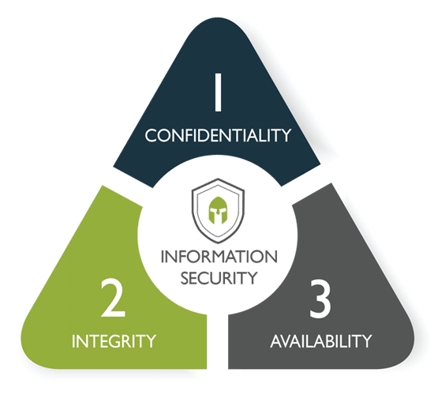

# Table of Contents

<!--toc:start-->
- [Table of Contents](#table-of-contents)
- [1. Safety principles](#1-safety-principles)
  - [1.1. Security objectives and associated functions](#11-security-objectives-and-associated-functions)
    - [1.1.1. Availability](#111-availability)
    - [1.1.2. Integrity](#112-integrity)
    - [1.1.3. Confidentiality](#113-confidentiality)
    - [1.1.4. Identification and Authentication](#114-identification-and-authentication)
    - [1.1.5. Non-repudiation](#115-non-repudiation)
  - [1.2. Areas of application of computer security](#12-areas-of-application-of-computer-security)
    - [1.2.1. Physical and environmental security](#121-physical-and-environmental-security)
    - [1.2.2. Operational safety](#122-operational-safety)
    - [1.2.3. Logical, application, and information security](#123-logical-application-and-information-security)
    - [1.2.4. Security of telecommunications infrastructures](#124-security-of-telecommunications-infrastructures)
    - [1.2.5. Special case of cybersecurity](#125-special-case-of-cybersecurity)
  - [1.3. Different facets of security](#13-different-facets-of-security)
    - [1.3.1. Security leadership](#131-security-leadership)
    - [1.3.2. Importance of legality in the security of information systems](#132-importance-of-legality-in-the-security-of-information-systems)
    - [1.3.3. Ethics and training](#133-ethics-and-training)
    - [1.3.4. Security architecture](#134-security-architecture)
<!--toc:end-->

# 1. Safety principles

## 1.1. Security objectives and associated functions

:::columns

:::{.column width=50%}

The **CIA Triad** stands for **C**onfidentiality, **I**ntegrity, and **A**vailability is a guiding model in information security.

A comprehensive information security strategy includes policies and security controls that minimize threats to these three crucial components.

::::

:::{.column width=35%}
{width=200px}
::::

:::

### 1.1.1. Availability

**Availability** means data are accessible when you need them.

**Availability** of data is crucial to daily operations of our system. Without access to our data, everything grinds to a halt, which is why medical and educational institutions are often targeted for ransomware attacks.

Ransomware attacks attempt to withhold **availability** of critical information until a ransom is paid. We use various hardware and software measures to detect and prevent such attacks, protecting the **availability** of our data. Our users also contribute to this effort by detecting and reporting phishing and other suspicious activity.

### 1.1.2. Integrity

**Integrity** means data are trustworthy, complete, and have not been accidentally altered or modified by an unauthorized user.

The **integrity** of data may be compromised unintentionally by a system malfunction, errors in entering data, or forgetting to maintain an up-to-date backup.

**Integrity** can also be compromised by malicious actors attempting to tamper with data. For example, a phishing scam aimed at changing bank account routing numbers in our payroll system is threat to the **integrity** of our data.

### 1.1.3. Confidentiality

**Confidentiality** refers to protecting information from unauthorized access. Maintaining **confidentiality** helps achieve multiple important goals, including ensuring privacy and avoiding ransomware attacks.

A familiar example we use to protect **confidentiality** is logging into systems using a 2FA key.

This login and identity authentication process protects the **confidentiality** of information created, stored, and transferred on our systems by restricting access to authorized users.

### 1.1.4. Identification and Authentication

**Identification** and **Authentication** are two crucial security principles that ensure only authorized users can access our systems and data.

- **Identification** establishes who a user is claiming to be. This might involve a username, an email address, or a unique identifier.
- **Authentication** verifies that the user is who they claim to be. This typically involves a password, a security token, or biometrics like fingerprints.

Our systems employ a multi-layered approach to **identification** and **authentication**. This might involve a combination of:

- Usernames and passwords
- Two-factor authentication (2FA) using security tokens or codes sent via SMS/email
- Biometric authentication (fingerprint scanners, facial recognition)

By implementing strong **identification** and **authentication** measures, we significantly reduce the risk of unauthorized access to our systems and data.

### 1.1.5. Non-repudiation

**Non-repudiation** ensures that a user cannot deny performing an action in a system. This is critical for maintaining accountability and preventing fraud.

Our systems typically achieve **non-repudiation** through comprehensive logging practices. These logs record user activity, including actions taken, timestamps, and user identifiers. With proper logging, a user cannot claim they did not perform an action if a clear record exists within the system.

**Non-repudiation** is particularly important for financial transactions, legal documents, and other sensitive actions where a clear audit trail is necessary.

## 1.2. Areas of application of computer security

Computer security measures are essential across various domains to protect critical information systems and infrastructure. Here's an overview of key areas where computer security plays a vital role:

### 1.2.1. Physical and environmental security

Securing physical infrastructure housing IT systems and data.

**e.g.**

- Access control systems (keycards, biometrics) for data centers and server rooms.
- Environmental controls (temperature, humidity, fire suppression) to safeguard hardware.
- Disaster recovery plans to ensure business continuity in case of natural disasters or power outages.

### 1.2.2. Operational safety

Implementing procedures and practices to minimize human errors and system vulnerabilities.

**e.g.**

- Change management processes to control system updates and configurations.
- Data backup and recovery procedures to restore data in case of accidental deletion or system crashes.
- Regular security training for employees to raise awareness and promote safe practices.

### 1.2.3. Logical, application, and information security

Protecting the integrity, confidentiality, and availability of data at rest, in transit, and in use.

**e.g.**

- Encryption of data on storage devices and during transmission across networks.
- Access control mechanisms (permissions, roles) to limit access to sensitive data.
- Vulnerability management practices to identify and patch software vulnerabilities in applications and operating systems.

### 1.2.4. Security of telecommunications infrastructures

Protecting communication channels and networks used for data transmission.

**e.g.**

- Secure network protocols (HTTPS, SSH) to encrypt data traffic.
- Firewalls to filter incoming and outgoing network traffic based on security policies.
- Intrusion detection/prevention systems (IDS/IPS) to monitor networks for malicious activities.

### 1.2.5. Special case of cybersecurity

Protecting information systems and digital assets from cyberattacks and threats originating from the internet.

**e.g.**

- Anti-malware and antivirus software to detect and remove malicious code.
- Web filtering to block access to malicious websites.
- Patch management to keep software and applications up-to-date with security fixes.

## 1.3. Different facets of security

Beyond the technical aspects, computer security encompasses a broader range of considerations for a holistic approach. Here are some additional facets:

### 1.3.1. Security leadership

Commitment and direction from management to prioritize security practices.

**e.g.**

- Establishing a clear security policy that outlines the organization's security objectives and expectations.
- Allocating resources for security training and infrastructure upgrades.
- Appointing a dedicated security officer or team to oversee security initiatives.

### 1.3.2. Importance of legality in the security of information systems

Ensuring compliance with relevant data privacy laws and regulations.

**e.g.**

- Implementing data handling procedures that adhere to regulations like GDPR (General Data Protection Regulation) or HIPAA (Health Insurance Portability and Accountability Act).
- Maintaining auditable logs of user activity for compliance and accountability purposes.
- Seeking legal counsel when necessary to ensure compliance with evolving privacy laws.

### 1.3.3. Ethics and training

Fostering a culture of ethical security practices and raising employee awareness.

**e.g.**

- Providing regular security awareness training to educate employees on security threats, phishing scams, and best practices.
- Establishing clear policies regarding acceptable use of technology and information assets.
- Promoting ethical behavior in data handling and reporting security incidents.

### 1.3.4. Security architecture

Designing and implementing a comprehensive security framework to mitigate risks.

**e.g.**

- Conducting regular security assessments to identify vulnerabilities in systems and networks.
- Implementing a layered security approach (defense in depth) with multiple security controls at different levels (physical, network, application, data).
- Regularly reviewing and updating the security architecture to adapt to evolving threats and technologies.
